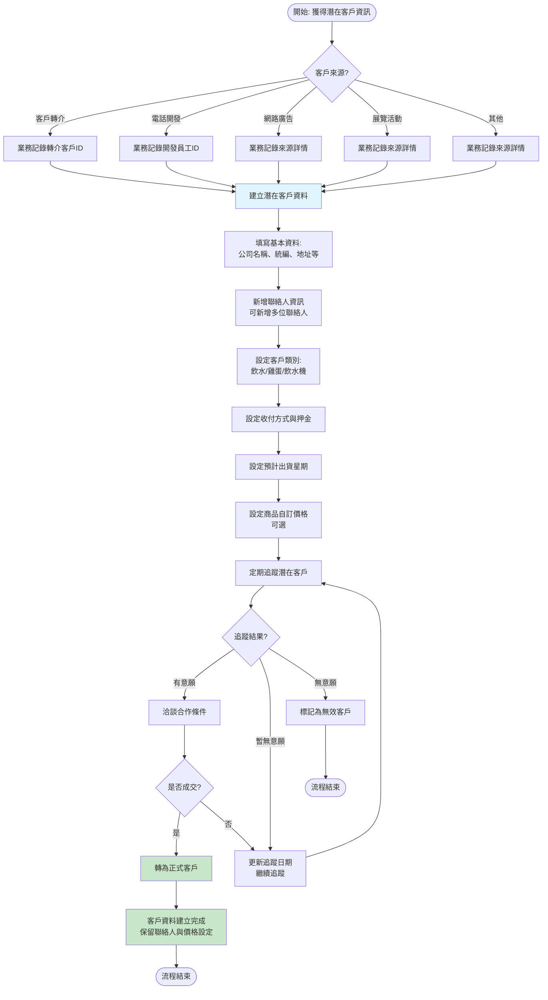
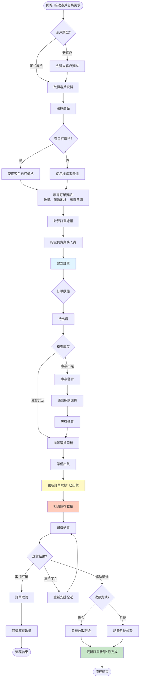
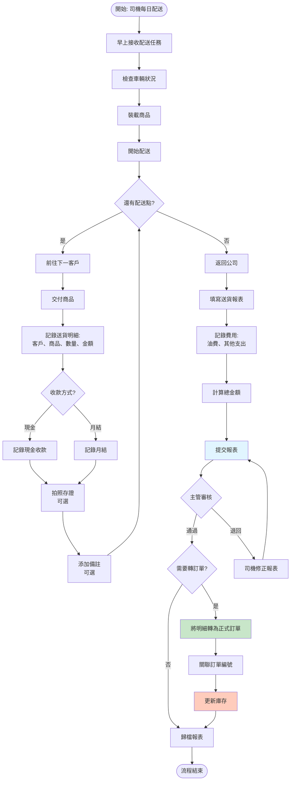
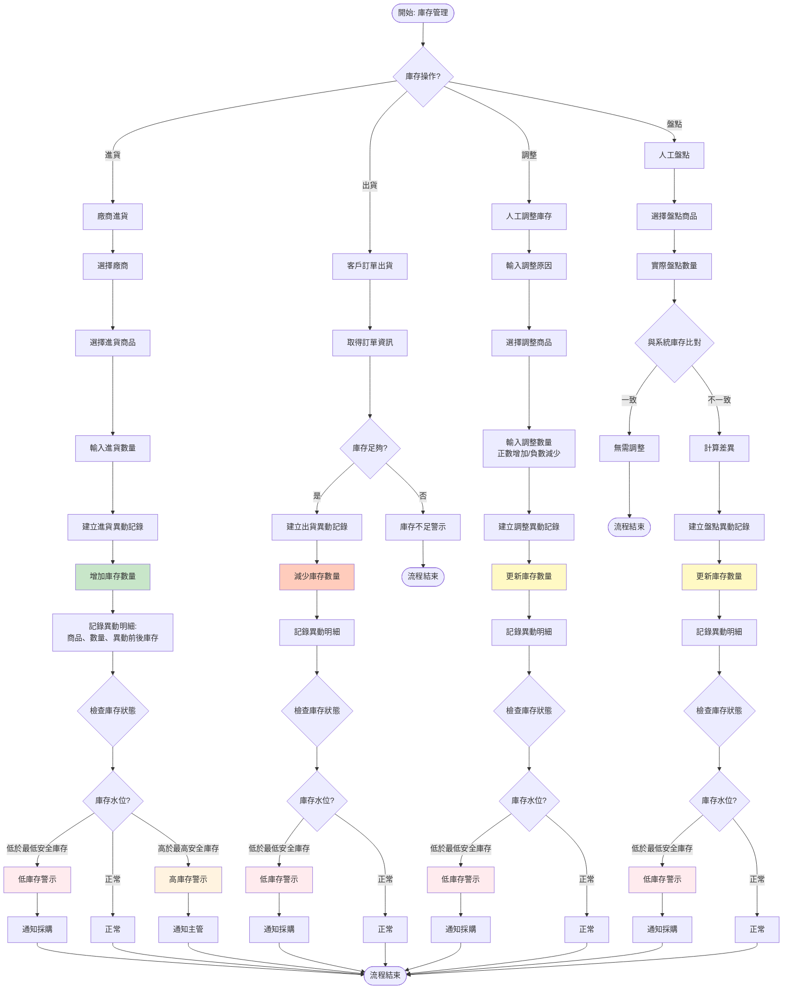
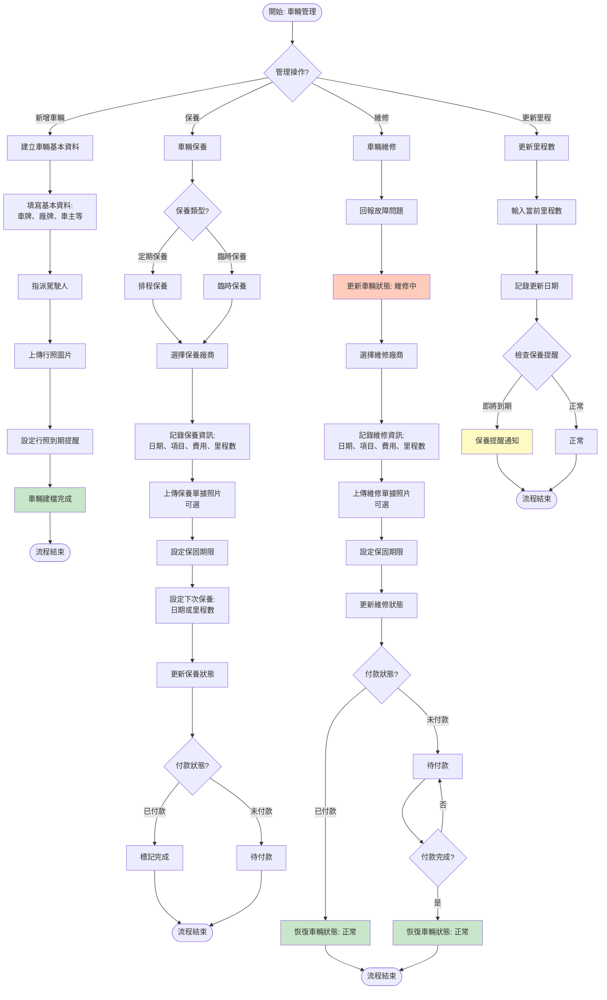

# CRM 管理系統 - 業務流程圖

## Business Process Flowchart

此圖展示 CRM 系統中各個角色在業務流程中的操作步驟與資料流向。

## 1. 客戶開發與管理流程

## 2. 訂單處理流程

## 3. 司機送貨報表流程

## 4. 庫存管理流程

## 5. 車輛管理流程

## 角色與權限說明

### 1. 業務人員
- **客戶開發**: 建立潛在客戶、追蹤、轉正
- **訂單處理**: 接單、建立訂單、指派配送
- **價格管理**: 設定客戶自訂價格

### 2. 送貨司機
- **配送執行**: 執行配送任務
- **報表填寫**: 填寫每日送貨報表
- **收款記錄**: 記錄現金收款

### 3. 倉管人員
- **庫存管理**: 進貨、出貨、調整、盤點
- **庫存監控**: 監控庫存水位、發出警示
- **採購通知**: 低庫存時通知採購

### 4. 管理階層
- **報表審核**: 審核司機送貨報表
- **資料審查**: 審查各類資料異常
- **決策支援**: 查看統計報表

### 5. 系統管理員
- **員工管理**: 管理員工帳號與權限
- **廠商管理**: 管理廠商資料
- **車輛管理**: 管理車輛與維護記錄
- **系統設定**: 系統參數設定

## 版本資訊
- **版本**: v1.0
- **建立日期**: 2025-01-03
