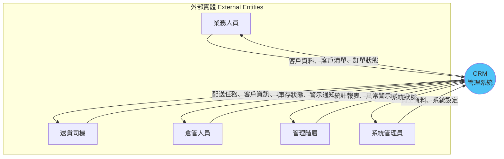
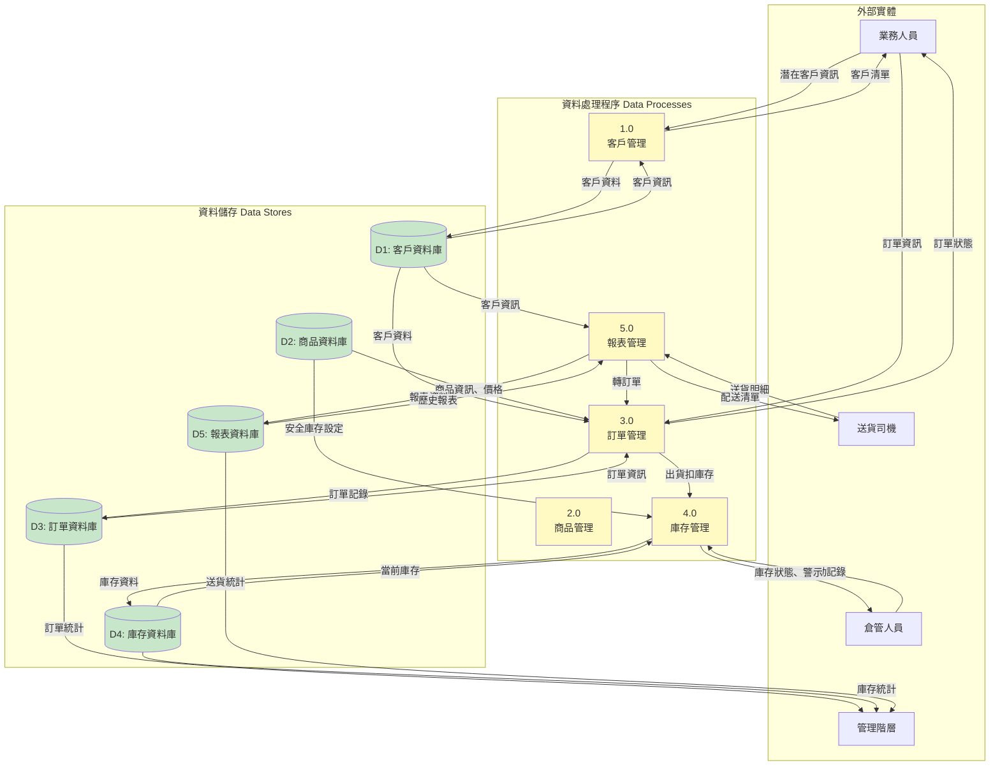
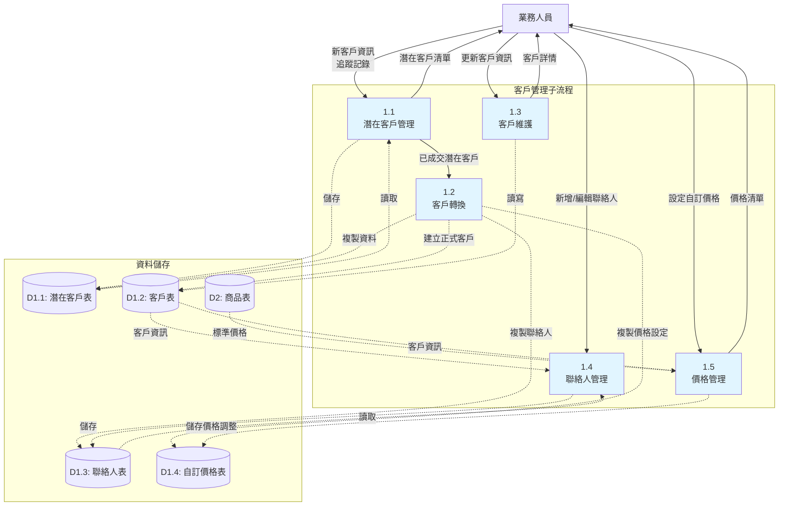
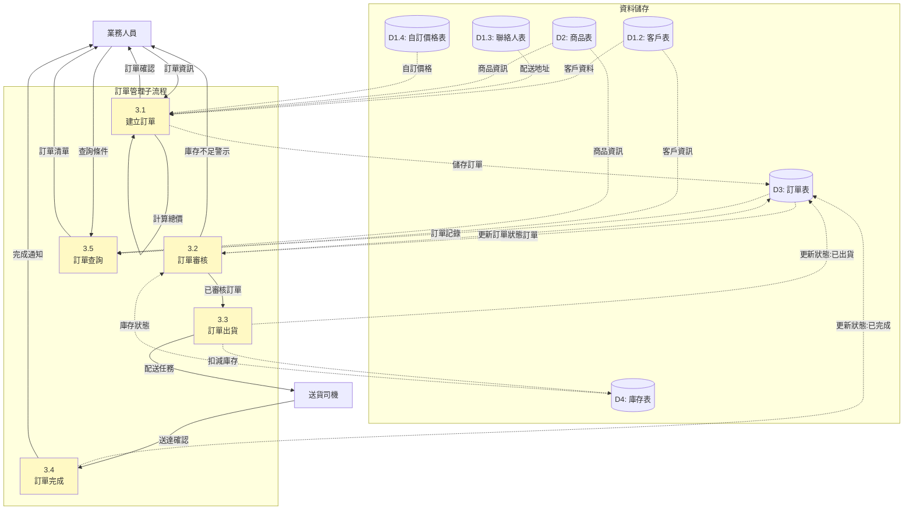
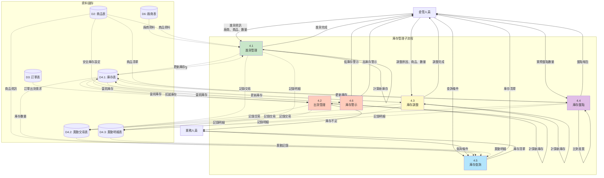
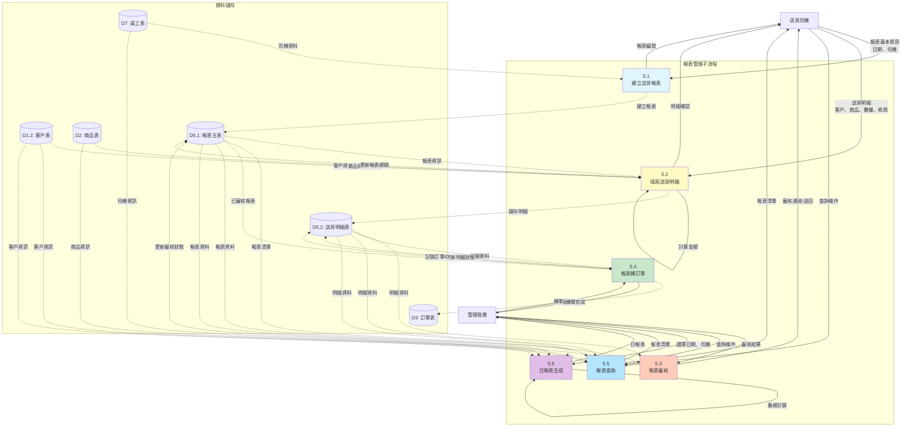

# CRM 管理系統 - 資料流程圖

## Data Flow Diagram (DFD)

此圖展示系統中資料的流動路徑、處理過程與儲存位置。

## Level 0: 系統總覽 (Context Diagram)

## Level 1: 主要功能模組資料流

## Level 2: 客戶管理詳細資料流

## Level 2: 訂單管理詳細資料流

## Level 2: 庫存管理詳細資料流

## Level 2: 報表管理詳細資料流

## 資料字典 (Data Dictionary)

### 主要資料流

| 資料流名稱 | 來源 | 目的地 | 內容描述 |
|-----------|------|--------|----------|
| 客戶資料 | 業務人員 | 客戶管理 | 公司名稱、統編、聯絡人、地址、電話、Email |
| 訂單資訊 | 業務人員 | 訂單管理 | 客戶ID、商品ID、數量、單價、配送地址、出貨日期 |
| 送貨明細 | 送貨司機 | 報表管理 | 客戶名稱、商品、數量、金額、收款方式、備註 |
| 異動記錄 | 倉管人員 | 庫存管理 | 異動類型、商品、數量、關聯對象、原因 |
| 庫存警示 | 庫存管理 | 倉管人員 | 商品名稱、當前庫存、安全庫存、警示類型 |
| 統計報表 | 各模組 | 管理階層 | 訂單統計、庫存統計、送貨統計 |

### 主要資料儲存

| 資料庫名稱 | 說明 | 主要欄位 |
|-----------|------|----------|
| D1: 客戶資料庫 | 儲存客戶與潛在客戶資料 | 客戶ID、公司名稱、統編、聯絡人、自訂價格 |
| D2: 商品資料庫 | 儲存商品基本資料 | 商品ID、類別、名稱、規格、零售價、安全庫存 |
| D3: 訂單資料庫 | 儲存所有訂單記錄 | 訂單ID、客戶ID、商品ID、數量、金額、狀態 |
| D4: 庫存資料庫 | 儲存庫存與異動記錄 | 庫存ID、商品ID、當前庫存、異動記錄 |
| D5: 報表資料庫 | 儲存送貨報表資料 | 報表ID、司機ID、日期、明細、總額 |
| D6: 廠商資料庫 | 儲存廠商基本資料 | 廠商ID、類別、公司名稱、聯絡資訊、帳戶資訊 |
| D7: 員工資料庫 | 儲存員工基本資料 | 員工ID、姓名、職位、聯絡資訊、狀態 |
| D8: 車輛資料庫 | 儲存車輛與維護記錄 | 車輛ID、車牌、駕駛、保養記錄、維修記錄 |

## 資料流向總結

### 核心資料流
1. **客戶資料流**: 潛在客戶 → 追蹤 → 轉正式客戶 → 下訂單 → 接收送貨
2. **訂單資料流**: 建立訂單 → 審核 → 出貨（扣庫存）→ 配送 → 完成
3. **庫存資料流**: 進貨（加庫存）→ 出貨（扣庫存）→ 調整/盤點 → 警示
4. **報表資料流**: 送貨 → 記錄明細 → 提交報表 → 審核 → 轉訂單（可選）

### 資料一致性控制
- **庫存扣減**: 訂單出貨時同步扣減庫存，確保資料一致
- **報表轉單**: 送貨明細轉訂單時標記轉換狀態，避免重複轉換
- **價格計算**: 優先使用客戶自訂價格，否則使用標準零售價
- **聯絡人主次**: 每個客戶必須有一個主要聯絡人

### 資料驗證規則
- 訂單數量必須 > 0
- 庫存不能為負數
- 客戶統編格式驗證
- 出貨日期不能早於訂購日期
- 主要聯絡人唯一性檢查

## 版本資訊
- **版本**: v1.0
- **建立日期**: 2025-01-03
- **資料模型**: 關聯式資料模型
- **當前狀態**: 前端 Mock Data 模擬
