# CRM 管理系統 - 實體關聯圖 (ERD)

## Entity Relationship Diagram

此圖展示了 CRM 系統中所有資料表、欄位、主鍵、外鍵與關聯關係。

```mermaid
erDiagram
    %% ==================== 基本資料管理 ====================
    
    EMPLOYEE {
        int id PK "員工編號"
        string name "姓名"
        string idNumber "身分證字號"
        date birthDate "生日"
        string position "職位"
        string phone "電話"
        string email "電子郵件"
        string address "地址"
        date joinDate "到職日期"
        enum status "狀態(啟用/停用)"
    }
    
    CUSTOMER {
        int id PK "客戶編號"
        string companyName "公司名稱"
        string companyPhone "公司電話"
        string companyAddress "公司地址"
        string companyEmail "公司信箱"
        string taxId "統一編號"
        array categories "客戶類別(桶裝水/雞蛋/飲水機)"
        string paymentMethod "收付方式"
        decimal deposit "押金"
        string invoiceTitle "發票抬頭"
        string invoiceTaxId "發票統編"
        string note "備註"
        date registeredDate "建檔日期"
        array deliveryDays "預計出貨星期"
    }
    
    CUSTOMER_CONTACT {
        int id PK "聯絡人編號"
        int customerId FK "客戶編號"
        boolean isPrimary "是否為主要聯絡人"
        string name "姓名"
        string phone "電話"
        string address "地址"
        string email "電子郵件"
    }
    
    CUSTOMER_CUSTOM_PRICE {
        int id PK "價格編號"
        int customerId FK "客戶編號"
        string productId FK "商品編號"
        decimal adjustment "價格調整"
    }
    
    POTENTIAL_CUSTOMER {
        int id PK "潛在客戶編號"
        string companyName "公司名稱"
        string companyPhone "公司電話"
        string companyAddress "公司地址"
        string companyEmail "公司信箱"
        string taxId "統一編號"
        array categories "客戶類別"
        string paymentMethod "收付方式"
        decimal deposit "押金"
        string invoiceTitle "發票抬頭"
        string invoiceTaxId "發票統編"
        string note "備註"
        date registeredDate "建檔日期"
        array deliveryDays "預計出貨星期"
        enum source "來源(客戶轉介/電話開發/網路廣告/展覽活動/其他)"
        date trackDate "追蹤日期"
        int referralCustomerId FK "轉介客戶編號"
        int referralEmployeeId FK "開發員工編號"
        string sourceDetail "來源詳細說明"
    }
    
    POTENTIAL_CONTACT {
        int id PK "聯絡人編號"
        int potentialCustomerId FK "潛在客戶編號"
        boolean isPrimary "是否為主要聯絡人"
        string name "姓名"
        string phone "電話"
        string address "地址"
        string email "電子郵件"
    }
    
    POTENTIAL_CUSTOM_PRICE {
        int id PK "價格編號"
        int potentialCustomerId FK "潛在客戶編號"
        string productId FK "商品編號"
        decimal adjustment "價格調整"
    }
    
    VENDOR {
        int id PK "廠商編號"
        enum category "類別(桶裝水/飲水機/車輛/雞蛋)"
        string companyName "公司名稱"
        string companyPhone "公司電話"
        string companyAddress "公司地址"
        string email "電子郵件"
        string contactName "聯絡人姓名"
        string contactPhone "聯絡人電話"
        string accountName "戶名"
        string accountNumber "帳號"
        string bank "銀行"
        string branch "分行"
        string notes "備註"
        enum status "狀態(啟用/停用)"
    }
    
    VEHICLE {
        int id PK "車輛編號"
        string plateNumber "車牌號碼"
        string brand "車輛廠牌"
        string ownerName "車主姓名"
        string driverName "駕駛人姓名"
        int manufactureYear "出廠年份"
        date purchaseDate "購入日期"
        date licenseExpiry "行照到期日"
        int mileage "里程數"
        date mileageDate "里程日期"
        string licenseImage "行照圖片"
        string notes "備註"
        enum status "狀態(正常/維修中/報廢)"
    }
    
    VEHICLE_MAINTENANCE {
        int id PK "保養編號"
        int vehicleId FK "車輛編號"
        string vendor "廠商"
        date date "保養日期"
        string items "保養項目"
        decimal cost "費用"
        date warrantyExpiry "保固到期日"
        int mileage "里程數"
        date nextMaintenanceDate "下次保養日期"
        int nextMaintenanceMileage "下次保養里程"
        enum status "狀態(完成/待付款/保固內)"
        array images "圖片"
    }
    
    VEHICLE_REPAIR {
        int id PK "維修編號"
        int vehicleId FK "車輛編號"
        string vendor "廠商"
        date date "維修日期"
        string items "維修項目"
        decimal cost "費用"
        date warrantyExpiry "保固到期日"
        int mileage "里程數"
        date nextRepairDate "下次維修日期"
        int nextRepairMileage "下次維修里程"
        enum status "狀態(完成/待付款/保固內)"
        array images "圖片"
    }
    
    %% ==================== 商品管理 ====================
    
    PRODUCT {
        string id PK "商品編號"
        enum category "類別(桶裝水/雞蛋/飲水機)"
        string name "商品名稱"
        string spec "規格"
        decimal retailPrice "零售價"
        int minStock "最低安全庫存量"
        int maxStock "最高安全庫存量"
    }
    
    INVENTORY {
        int id PK "庫存編號"
        string productId FK "商品編號"
        int currentStock "當前庫存量"
    }
    
    INVENTORY_TRANSACTION {
        int id PK "異動編號"
        enum transactionType "異動類型(進貨/出貨/調整/盤點)"
        enum relatedType "關聯類型(廠商進貨單/客戶訂單/人工調整/人工盤點)"
        int relatedId "關聯對象編號"
        string relatedName "關聯對象名稱"
        string orderId "訂單編號"
        string reasonNote "原因備註"
        datetime transactionDate "異動日期"
        int operatorId FK "操作人員編號"
        string operatorName "操作人員姓名"
    }
    
    INVENTORY_PRODUCT_ITEM {
        int id PK "項目編號"
        int transactionId FK "異動編號"
        enum productCategory "商品類別"
        string productId FK "商品編號"
        string productName "商品名稱"
        int changeAmount "異動數量"
        int stockBefore "異動前庫存"
        int stockAfter "異動後庫存"
    }
    
    %% ==================== 訂單管理 ====================
    
    ORDER {
        int id PK "訂單編號"
        enum type "訂單類型(water/egg/dispenser)"
        int customerId FK "客戶編號"
        int employeeId FK "員工編號"
        string productId FK "商品編號"
        string productName "商品名稱"
        date orderDate "訂購日期"
        date shipDate "出貨日期"
        int quantity "數量"
        decimal unitPrice "單價"
        decimal total "總價"
        enum status "狀態(待出貨/已出貨/已完成/已取消)"
        string address "配送地址"
        string note "備註"
    }
    
    %% ==================== 司機送貨報表 ====================
    
    DELIVERY_REPORT {
        int id PK "報表編號"
        int employeeId FK "員工編號(司機)"
        string employeeName "員工姓名"
        date reportDate "報表日期"
        string weekDays "星期"
        decimal totalAmount "總金額"
        decimal fuelExpense "油費支出"
        decimal otherExpense "其他支出"
    }
    
    DELIVERY_PRODUCT_DETAIL {
        int id PK "明細編號"
        int reportId FK "報表編號"
        int productId "商品編號"
        string productName "商品名稱"
        string customerName "客戶名稱"
        int customerId FK "客戶編號"
        int quantity "數量"
        decimal unitPrice "單價"
        decimal amount "金額"
        string paymentMethod "收款方式"
        string note "備註"
        boolean isConvertedToOrder "是否已轉訂單"
        int orderId FK "訂單編號"
    }
    
    %% ==================== 關聯關係 ====================
    
    %% 客戶關聯
    CUSTOMER ||--o{ CUSTOMER_CONTACT : "有多個聯絡人"
    CUSTOMER ||--o{ CUSTOMER_CUSTOM_PRICE : "有自訂價格"
    CUSTOMER ||--o{ ORDER : "下多筆訂單"
    CUSTOMER ||--o{ DELIVERY_PRODUCT_DETAIL : "接收送貨"
    
    %% 潛在客戶關聯
    POTENTIAL_CUSTOMER ||--o{ POTENTIAL_CONTACT : "有多個聯絡人"
    POTENTIAL_CUSTOMER ||--o{ POTENTIAL_CUSTOM_PRICE : "有自訂價格"
    POTENTIAL_CUSTOMER }o--|| CUSTOMER : "轉介自客戶(可選)"
    POTENTIAL_CUSTOMER }o--|| EMPLOYEE : "電話開發自員工(可選)"
    
    %% 員工關聯
    EMPLOYEE ||--o{ ORDER : "處理訂單"
    EMPLOYEE ||--o{ DELIVERY_REPORT : "提交報表"
    EMPLOYEE ||--o{ INVENTORY_TRANSACTION : "操作庫存"
    
    %% 車輛關聯
    VEHICLE ||--o{ VEHICLE_MAINTENANCE : "有保養記錄"
    VEHICLE ||--o{ VEHICLE_REPAIR : "有維修記錄"
    
    %% 商品關聯
    PRODUCT ||--|| INVENTORY : "有庫存記錄"
    PRODUCT ||--o{ CUSTOMER_CUSTOM_PRICE : "客戶自訂價"
    PRODUCT ||--o{ POTENTIAL_CUSTOM_PRICE : "潛在客戶自訂價"
    PRODUCT ||--o{ ORDER : "訂單項目"
    PRODUCT ||--o{ INVENTORY_PRODUCT_ITEM : "庫存異動項目"
    
    %% 庫存異動關聯
    INVENTORY_TRANSACTION ||--o{ INVENTORY_PRODUCT_ITEM : "包含多個商品異動"
    
    %% 報表關聯
    DELIVERY_REPORT ||--o{ DELIVERY_PRODUCT_DETAIL : "包含多筆送貨明細"
    DELIVERY_PRODUCT_DETAIL }o--|| ORDER : "可轉為訂單"
```

## 資料表說明

### 基本資料管理
- **EMPLOYEE**: 員工資料表，儲存所有員工基本資訊
- **CUSTOMER**: 客戶資料表，儲存正式客戶的完整資訊
- **CUSTOMER_CONTACT**: 客戶聯絡人表，一個客戶可有多個聯絡人
- **CUSTOMER_CUSTOM_PRICE**: 客戶自訂價格表，記錄特定客戶的商品價格調整
- **POTENTIAL_CUSTOMER**: 潛在客戶資料表，結構類似客戶表但多了追蹤相關欄位
- **POTENTIAL_CONTACT**: 潛在客戶聯絡人表
- **POTENTIAL_CUSTOM_PRICE**: 潛在客戶自訂價格表
- **VENDOR**: 廠商資料表，管理各類供應商資訊
- **VEHICLE**: 車輛資料表，記錄公司車輛基本資訊
- **VEHICLE_MAINTENANCE**: 車輛保養記錄表
- **VEHICLE_REPAIR**: 車輛維修記錄表

### 商品與庫存管理
- **PRODUCT**: 商品主檔，定義商品基本資訊和安全庫存量
- **INVENTORY**: 商品庫存表，記錄實際庫存數量
- **INVENTORY_TRANSACTION**: 庫存異動主表，記錄每次異動的基本資訊
- **INVENTORY_PRODUCT_ITEM**: 庫存異動明細表，記錄具體商品的異動詳情

### 訂單管理
- **ORDER**: 訂單主表，記錄所有類型訂單（桶裝水/雞蛋/飲水機）

### 司機送貨報表
- **DELIVERY_REPORT**: 送貨報表主表，記錄司機每日送貨基本資訊
- **DELIVERY_PRODUCT_DETAIL**: 送貨明細表，記錄每筆送貨的商品詳情

## 關鍵業務邏輯

### 1. 潛在客戶轉正式客戶
- 潛在客戶可轉換為正式客戶
- 轉換時保留所有聯絡人和自訂價格設定

### 2. 庫存管理架構
- 商品表（PRODUCT）只記錄「最低/最高安全庫存量」作為建議值
- 實際庫存量由獨立的「商品庫存表（INVENTORY）」管理
- 透過進貨操作累加到對應商品的實際庫存量中
- 每次異動都完整記錄異動前後庫存量

### 3. 司機送貨報表轉訂單
- 送貨明細可選擇性轉換為正式訂單
- 轉換後在明細記錄關聯的訂單編號
- `isConvertedToOrder` 標記是否已轉單

### 4. 價格管理
- 商品有標準零售價（retailPrice）
- 客戶可設定個別商品的價格調整（adjustment）
- 實際售價 = 零售價 + 調整金額

### 5. 多聯絡人管理
- 客戶和潛在客戶都支援多個聯絡人
- 必須指定一個主要聯絡人（isPrimary）

## 版本資訊
- **版本**: v1.0
- **建立日期**: 2025-01-03
- **資料時間範圍**: 2025年度
