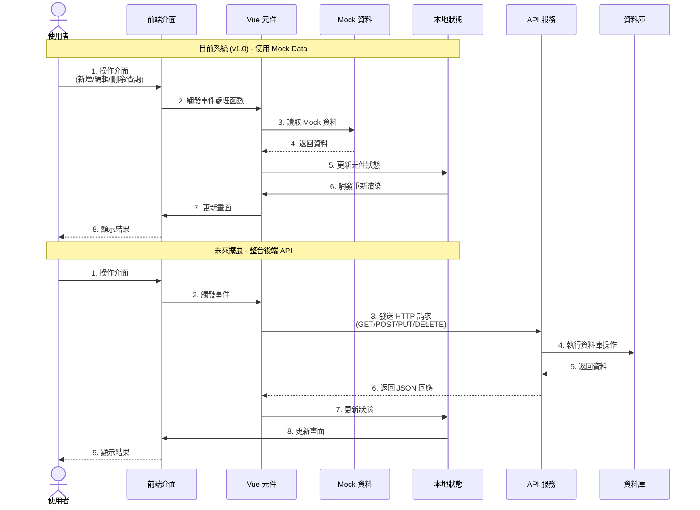
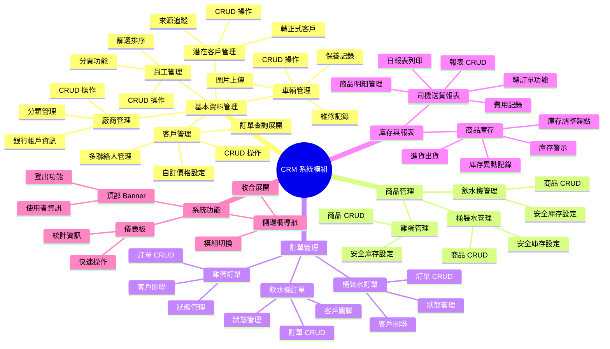

# CRM 管理系統 - 系統架構圖

## System Architecture Diagram

此圖展示系統的前端、後端、資料庫層級架構與資料流向。

## 整體系統架構

```mermaid
graph TB
    subgraph "客戶端 Client"
        Browser[Web Browser<br/>瀏覽器]
    end
    
    subgraph "前端層 Frontend Layer"
        VueApp[Vue 3 SPA<br/>Vue + TypeScript + Vite]
        UI[UI Components<br/>OpenTiny Vue + 自訂 wrapper]
        State[State Management<br/>Vue Composition API + Local State]
        Router[Routing<br/>Vue Router 4]
    end
    
    subgraph "業務邏輯層 Business Logic Layer"
        EmployeeModule[員工管理模組<br/>EmployeeManagement]
        CustomerModule[客戶管理模組<br/>CustomerManagement]
        PotentialModule[潛在客戶模組<br/>PotentialCustomerManagement]
        VendorModule[廠商管理模組<br/>VendorManagement]
        VehicleModule[車輛管理模組<br/>VehicleManagement]
        ProductModule[商品管理模組<br/>Product Management]
        InventoryModule[庫存管理模組<br/>InventoryManagement]
        OrderModule[訂單管理模組<br/>Order Management]
        ReportModule[報表管理模組<br/>DeliveryReport]
        DashboardModule[儀表板模組<br/>Dashboard]
    end
    
    subgraph "資料存取層 Data Access Layer - 目前使用 Mock Data"
        MockProducts[Mock Products<br/>商品假資料]
        MockOrders[Mock Orders<br/>訂單假資料]
        LocalState1[Local Component State<br/>元件本地狀態]
    end
    
    subgraph "未來擴展 - 後端 API 層 Backend API Layer"
        APIGateway[API Gateway<br/>API 閘道]
        AuthService[Authentication Service<br/>身分驗證服務]
        
        subgraph "RESTful APIs"
            EmployeeAPI[Employee API<br/>員工 API]
            CustomerAPI[Customer API<br/>客戶 API]
            ProductAPI[Product API<br/>商品 API]
            InventoryAPI[Inventory API<br/>庫存 API]
            OrderAPI[Order API<br/>訂單 API]
            ReportAPI[Report API<br/>報表 API]
        end
    end
    
    subgraph "未來擴展 - 資料庫層 Database Layer"
        Database[(PostgreSQL / MySQL<br/>關聯式資料庫)]
        
        subgraph "資料表 Tables"
            EmpTable[(EMPLOYEE)]
            CustTable[(CUSTOMER)]
            PotentialTable[(POTENTIAL_CUSTOMER)]
            VendorTable[(VENDOR)]
            VehicleTable[(VEHICLE)]
            ProductTable[(PRODUCT)]
            InventoryTable[(INVENTORY)]
            OrderTable[(ORDER)]
            ReportTable[(DELIVERY_REPORT)]
        end
    end
    
    subgraph "未來擴展 - 檔案儲存 File Storage"
        FileStorage[File Storage Service<br/>檔案儲存服務<br/>AWS S3 / Azure Blob]
    end
    
    %% 前端連接
    Browser --> VueApp
    VueApp --> UI
    VueApp --> State
    VueApp --> Router
    
    %% 模組連接
    Router --> EmployeeModule
    Router --> CustomerModule
    Router --> PotentialModule
    Router --> VendorModule
    Router --> VehicleModule
    Router --> ProductModule
    Router --> InventoryModule
    Router --> OrderModule
    Router --> ReportModule
    Router --> DashboardModule
    
    %% 當前資料流 (Mock Data)
    EmployeeModule -.->|使用 Mock Data| LocalState1
    CustomerModule -.->|使用 Mock Data| LocalState1
    PotentialModule -.->|使用 Mock Data| LocalState1
    VendorModule -.->|使用 Mock Data| LocalState1
    VehicleModule -.->|使用 Mock Data| LocalState1
    ProductModule -.->|使用 Mock Data| MockProducts
    OrderModule -.->|使用 Mock Data| MockOrders
    InventoryModule -.->|使用 Mock Data| LocalState1
    ReportModule -.->|使用 Mock Data| LocalState1
    DashboardModule -.->|使用 Mock Data| LocalState1
    
    %% 未來 API 連接 (虛線表示未來擴展)
    EmployeeModule -.->|未來| EmployeeAPI
    CustomerModule -.->|未來| CustomerAPI
    PotentialModule -.->|未來| CustomerAPI
    ProductModule -.->|未來| ProductAPI
    InventoryModule -.->|未來| InventoryAPI
    OrderModule -.->|未來| OrderAPI
    ReportModule -.->|未來| ReportAPI
    
    %% API 層連接
    EmployeeAPI -.->|未來| APIGateway
    CustomerAPI -.->|未來| APIGateway
    ProductAPI -.->|未來| APIGateway
    InventoryAPI -.->|未來| APIGateway
    OrderAPI -.->|未來| APIGateway
    ReportAPI -.->|未來| APIGateway
    
    APIGateway -.->|未來| AuthService
    
    %% 資料庫連接
    EmployeeAPI -.->|未來| EmpTable
    CustomerAPI -.->|未來| CustTable
    CustomerAPI -.->|未來| PotentialTable
    ProductAPI -.->|未來| ProductTable
    InventoryAPI -.->|未來| InventoryTable
    OrderAPI -.->|未來| OrderTable
    ReportAPI -.->|未來| ReportTable
    
    EmpTable -.->|未來| Database
    CustTable -.->|未來| Database
    PotentialTable -.->|未來| Database
    VendorTable -.->|未來| Database
    VehicleTable -.->|未來| Database
    ProductTable -.->|未來| Database
    InventoryTable -.->|未來| Database
    OrderTable -.->|未來| Database
    ReportTable -.->|未來| Database
    
    %% 檔案上傳連接
    VehicleModule -.->|未來: 行照圖片| FileStorage
    ReportModule -.->|未來: 送貨照片| FileStorage
    
    style VueApp fill:#42b883
    style Database fill:#336791
    style APIGateway fill:#ff6b6b
    style AuthService fill:#ffd93d
    style FileStorage fill:#95e1d3
```



## 前端技術架構詳細說明

```mermaid
graph LR
    subgraph "前端技術棧 Frontend Tech Stack"
        direction TB
        
        subgraph "框架 Framework"
            Vue3[Vue 3 + Vite<br/>主框架]
            TS[TypeScript<br/>型別系統]
        end
        
        subgraph "UI 元件庫 UI Libraries"
            OpenTiny[OpenTiny Vue<br/>官方元件]
            Wrappers[UI Wrappers<br/>一致樣式封裝]
            Tailwind[Tailwind CSS<br/>樣式框架]
            TinyIcons[Tiny Icons<br/>@opentiny/vue-icon]
        end
        
        subgraph "表單處理 Form Handling"
            DateFns[date-fns<br/>日期處理]
        end
        
        subgraph "通知系統 Notification"
            Notify[@opentiny/vue-notify<br/>Toast 通知]
        end
        
        subgraph "狀態管理 State Management"
            Composition[Vue Composition API<br/>ref/reactive/computed]
            LocalStorage[Local Storage<br/>瀏覽器儲存]
        end
    end
    
    Vue3 --> OpenTiny
    Vue3 --> Wrappers
    Vue3 --> Tailwind
    Vue3 --> TinyIcons
    Vue3 --> DateFns
    Vue3 --> Notify
    Vue3 --> Composition
    Composition --> LocalStorage
```

## 資料流向圖



## 模組架構與職責



## 檔案結構對應

```
/
├── App.jsx                          # 主應用程式入口
├── components/                      # 元件目錄
│   ├── app-sidebar.jsx             # 側邊欄導航
│   ├── top-banner.jsx              # 頂部 Banner
│   ├── dashboard.jsx               # 儀表板
│   │
│   ├── employee-management.jsx      # 員工管理模組
│   ├── customer-management.jsx      # 客戶管理模組
│   ├── potential-customer-management.jsx  # 潛在客戶模組
│   ├── vendor-management.jsx        # 廠商管理模組
│   ├── vehicle-management.jsx       # 車輛管理模組
│   │
│   ├── bottled-water-management.jsx # 桶裝水商品管理
│   ├── egg-management.jsx           # 雞蛋商品管理
│   ├── water-dispenser-management.jsx # 飲水機商品管理
│   │
│   ├── bottled-water-orders.jsx     # 桶裝水訂單
│   ├── egg-orders.jsx               # 雞蛋訂單
│   ├── water-dispenser-orders.jsx   # 飲水機訂單
│   │
│   ├── inventory-management.jsx     # 庫存管理
│   ├── delivery-report-new.jsx      # 司機送貨報表
│   ├── delivery-report-edit-page.jsx # 報表編輯頁
│   ├── daily-shipping-report-enhanced.jsx # 日報表
│   │
│   └── ui/                          # UI 元件庫
│       ├── button.jsx
│       ├── input.jsx
│       ├── table.jsx
│       ├── dialog.jsx
│       ├── select.jsx
│       └── ... (其他 ShadCN 元件)
│
├── lib/                             # 工具函式與資料
│   ├── mock-products.js            # 商品假資料
│   └── mock-orders.js              # 訂單假資料
│
└── styles/
    └── globals.css                  # 全域樣式
```

## 未來系統擴展規劃

### 第一階段：後端 API 開發
- 建立 RESTful API 服務
- 實作身分驗證與授權機制
- 資料庫設計與建置

### 第二階段：資料遷移
- 將 Mock Data 遷移到資料庫
- 實作前後端資料同步
- 測試與驗證

### 第三階段：進階功能
- 檔案上傳與管理（圖片、文件）
- 報表匯出功能（PDF、Excel）
- 即時通知系統
- 權限角色管理

### 第四階段：效能優化
- 前端快取策略
- API 效能優化
- 資料庫索引優化
- CDN 部署

### 第五階段：行動端支援
- 響應式設計強化
- PWA 支援
- 行動端專屬功能

## 技術選型說明

### 前端框架選擇
- **Vue 3 + Vite**: 輕量高效，與 Composition API 搭配易於維護
- **TypeScript**: 提供型別安全，減少執行期錯誤
- **Tailwind CSS**: 快速開發，樣式一致性高
- **OpenTiny Vue + 自訂 Wrapper**: 官方元件庫搭配統一封裝，確保風格一致且可替換性高

### 未來後端建議
- **Node.js + Express** 或 **Python + FastAPI**
- **PostgreSQL** 或 **MySQL** 關聯式資料庫
- **Redis** 快取層
- **AWS S3** 或 **Azure Blob** 檔案儲存

## 版本資訊
- **版本**: v1.0 (Frontend Only - Mock Data)
- **建立日期**: 2025-01-03
- **前端框架**: Vue 3 + Vite + TypeScript
- **UI 庫**: OpenTiny Vue + Tailwind CSS + 封裝元件
- **資料狀態**: 使用 Mock Data（硬編碼假資料）
