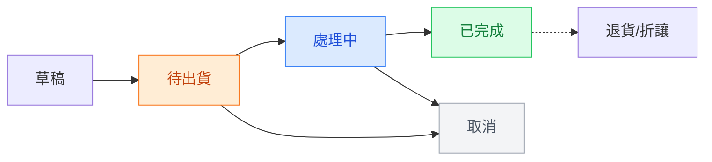
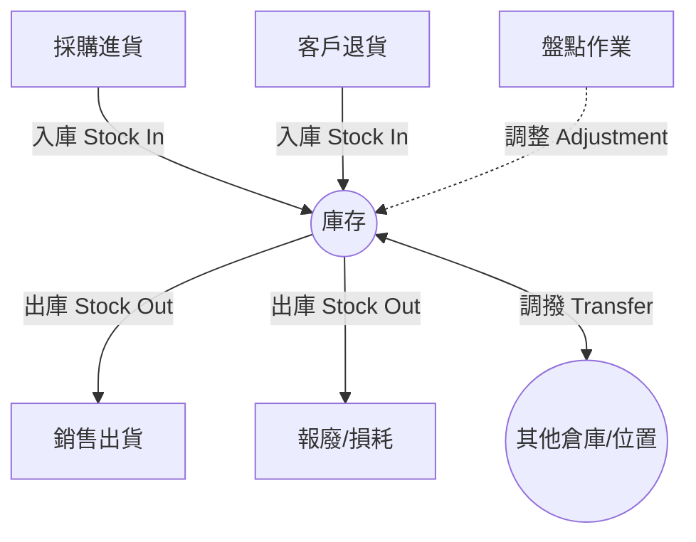
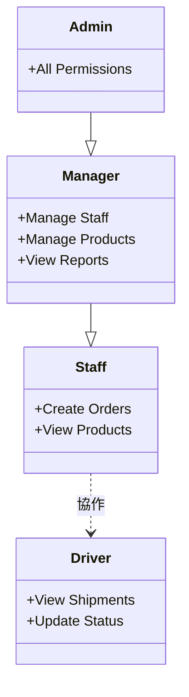

# 系統操作手冊

本手冊彙整了系統各模組的操作說明，協助您快速上手並有效地使用本系統。

## 目錄

1. [儀表板 (Dashboard)](#一-儀表板-dashboard)
2. [基本資料模組 (Basic Info)](#二-基本資料模組-basicinfo)
3. [商品管理模組 (Products)](#三-商品管理模組-products)
4. [訂單管理模組 (Orders)](#四-訂單管理模組-orders)
5. [庫存與報表模組 (Shipments/Inventory)](#五-庫存與報表模組-shipmentsinventory)
6. [帳務管理模組 (Finance)](#六-帳務管理模組-finance)
7. [參數設定模組 (Settings)](#七-參數設定模組-settings)

---

## 一、 儀表板 (Dashboard)

儀表板是系統的首頁，提供重要 KPI 指標和快速概覽。

[儀表板示意圖](/images/dashboard_mockup_1770018402913.png)

### 1.1 功能說明

#### KPI 統計卡片

儀表板上方顯示關鍵業績指標：

| 指標       | 說明                   |
| ---------- | ---------------------- |
| 今日訂單數 | 今天建立的訂單數量     |
| 今日營業額 | 今天的訂單總金額       |
| 本月訂單數 | 本月累計訂單數量       |
| 本月營業額 | 本月累計訂單金額       |
| 待出貨訂單 | 待處理的訂單數量       |
| 低庫存警示 | 低於安全庫存的商品數量 |

#### 訂單趨勢圖

顯示近期訂單的趨勢變化（可切換近 7 天/30 天/本月）。

#### 待處理事項

- **待出貨訂單**：點擊可快速進入訂單管理。
- **庫存警示**：列出低庫存或缺貨商品，點擊進入庫存管理。
- **待收款項**：列出尚未收款的請款單，點擊進入帳務管理。

---

## 二、 基本資料模組 (BasicInfo)

本模組包含系統的基礎資料管理功能，是其他業務模組的資料基礎。

### 2.1 員工管理 (User)

管理公司內部員工資料及帳號權限。

- **新增員工**：填寫帳號、姓名、密碼、角色等資訊。
- **角色權限**：角色決定員工在系統中的操作權限範圍。

### 2.2 客戶管理 (Customer)

管理公司客戶與個人客戶資料。

- **新增客戶**：分為公司客戶（需統編）與個人客戶。
- **查看訂單**：可直接查看該客戶的歷史交易記錄。

### 2.3 潛在客戶管理 (Lead)

管理尚未成交的潛在客戶。當潛在客戶確認合作後，可使用「轉換為客戶」功能，自動建立正式客戶資料。

### 2.4 廠商管理 (Vendor)

管理供應商資料，用於進貨與採購作業。操作方式與客戶管理類似。

### 2.5 車輛管理 (Car)

管理公司配送車輛資訊。

- **基本資料**：管理車牌、型號、載重、燃料類型等。
- **詳細資料**：記錄車輛的保養記錄、維修記錄及行程記錄（由訂單系統自動產生）。
- **指派司機**：將車輛指派給特定司機使用。

### 2.6 司機管理 (Driver)

從「員工資料」中將職務設為「司機」的帳號，會自動顯示於此列表中。

---

## 三、 商品管理模組 (Products)

本模組負責管理所有產品資料，包含飲水、雞蛋、飲水機三大類商品。

### 3.1 商品列表與操作

- **列表資訊**：顯示商品編號、名稱、單位、售價、成本、庫存及狀態。
- **新增商品**：設定基本資訊、價格（售價/成本）、庫存（初始/安全/最大庫存）及其他屬性（如易腐品）。
- **上下架**：商品下架後將無法在訂單中被選擇，但歷史記錄會保留。

### 3.2 商品分類特性

- **飲水**：通常以「桶」為單位，適用桶裝飲用水商品。
- **雞蛋**：通常以「箱」或「斤」為單位，需注意易腐特性。
- **飲水機**：通常以「台」為單位，可能有租賃或銷售模式。

### 3.3 庫存連動

商品建立後，實際的入庫、出庫及盤點作業需至「庫存與報表」模組進行。

---

## 四、 訂單管理模組 (Orders)

負責管理所有產品類型的訂單（銷售與採購）。

### 4.1 訂單類型

- **客戶訂單**：銷售給客戶，屬於銷貨行為。
- **廠商訂單**：向廠商採購，屬於進貨行為。
  頁面頂部提供頁籤切換查看不同對象的訂單。

### 4.2 訂單操作流程

1. **新增訂單**：選擇對象、日期、配送資訊，並新增商品明細。
2. **狀態流轉**：
   - **待出貨 (PENDING)**：訂單建立，等待處理。可修改所有內容。
   - **處理中 (PROCESSING)**：正在準備出貨。核心欄位鎖定，僅能改備註等。
   - **已完成 (DELIVERED)**：訂單送達。轉為唯讀，不可修改。
   - **取消 (CANCELLED)**：訂單已取消。

### 4.3 注意事項

- **自動晉升**：系統會協助處理後端狀態的過渡（如從草稿自動轉為待出貨）。
- **已完成訂單**：若需修改已完成訂單的帳務，請使用折讓單處理。

### 4.4 訂單狀態流轉圖

---

## 五、 庫存與報表模組 (Shipments/Inventory)

管理商品庫存異動、盤點及配送報表。

### 5.1 庫存管理

包含五大功能頁籤：

1. **庫存總覽**：查看即時庫存量、庫存價值及狀態（正常/低庫存/缺貨）。
2. **異動記錄**：查詢所有的入庫、出庫、調整、調撥記錄。
   - **入庫**：進貨或退貨入庫。
   - **出庫**：銷售或報廢出庫。
   - **調整**：盤點差異調整。
3. **庫存警示**：集中顯示低庫存、缺貨及需補貨項目，支援快速入庫。
4. **庫存調撥**：在不同倉庫或位置間移動庫存。
5. **庫存報表**：提供估值報表與週轉率分析報表，支援匯出 Excel。

### 5.2 盤點作業

1. 選擇盤點位置與人員。
2. 輸入實際盤點數量。
3. 系統自動計算差異（正負數）。
4. 完成盤點後自動產生調整記錄。

### 5.3 庫存異動流程

### 5.4 送貨報表

查看司機的配送統計（單數、完成率）及詳細配送明細，可依照日期、司機或車輛篩選並匯出。

---

## 六、 帳務管理模組 (Finance)

管理請款、折讓、付款及帳務報表。

### 6.1 功能分頁

1. **請款單**：管理向客戶的請款。狀態流程：待處理 → 已請款 → 已收款。
2. **折讓單**：處理退貨或價格調整。流程：待審核 → 已核准 → 已沖銷。
3. **付款紀錄**：記錄所有的收款（來自客戶）與付款（給廠商）。
4. **帳務報表**：提供應收帳款、應付帳款、收款統計及銷售統計報表。

### 6.2 常見操作

- **收款**：在請款單中點擊「收款」，輸入金額與方式，系統自動更新狀態。
- **沖銷**：核准後的折讓單可用於沖銷應收帳款。
- **報表匯出**：所有報表皆支援匯出 Excel 以供進一步分析。

---

## 七、 參數設定模組 (Settings)

基礎參數設定，通常由系統管理員操作。

### 7.1 角色設定 (Roles)

管理系統角色（如 ADMIN, MANAGER, STAFF, DRIVER）。可自訂角色並配置其權限。

### 7.2 權限設定 (Permission)

定義各角色對系統資源（如訂單、商品、客戶等）的操作權限（新增、查看、編輯、刪除）。

### 7.3 產品類型設定 (ProductType)

管理商品的分類類型（如 WATER, EGG, MACHINE）。注意：已有商品的類型無法刪除。
